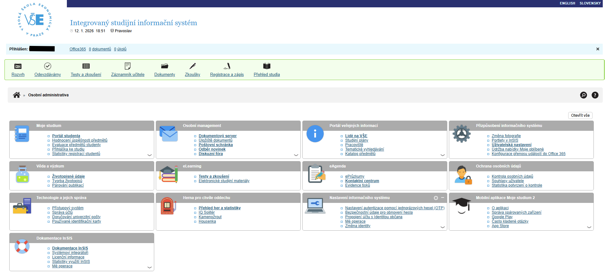
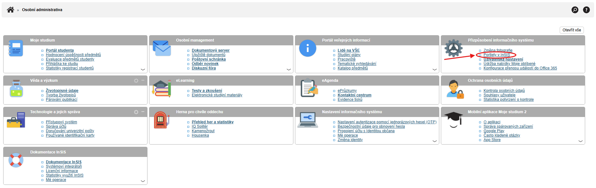
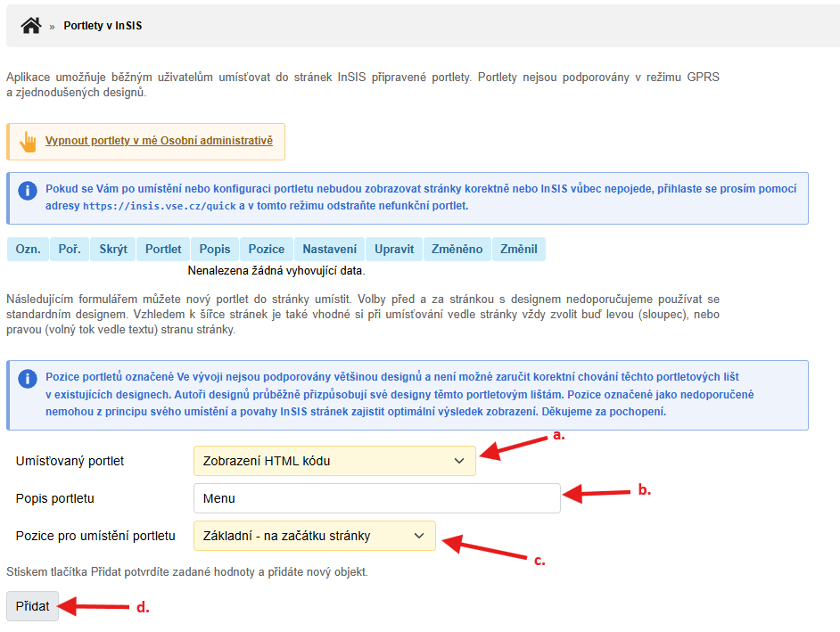
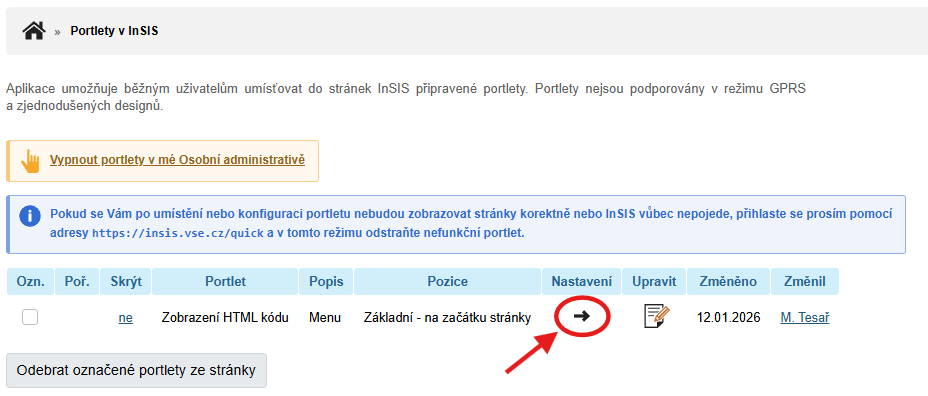
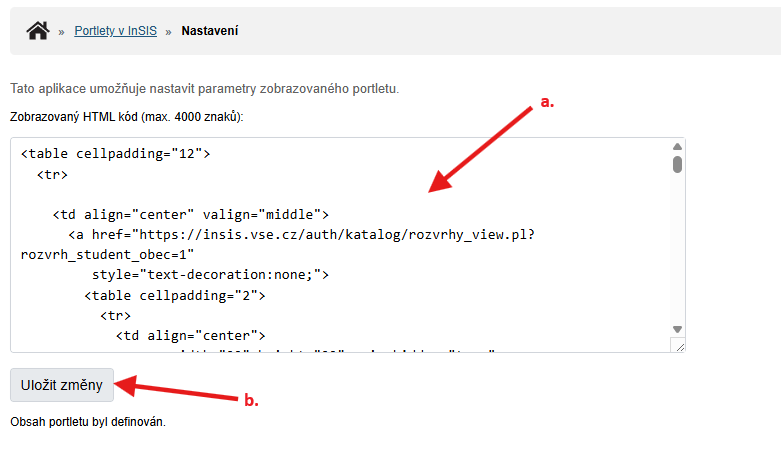

# InSIS VŠE – horní navigační lišta s ikonami

Tento projekt přidává **přehlednou horní navigační lištu s ikonami** do informačního systému **InSIS VŠE**.  
Cílem je zpřístupnit nejčastěji používané sekce (rozvrh, odevzdávárny, testy, dokumenty, zkoušky apod.) **rychleji, přehledněji a vizuálně čitelněji**, než umožňuje výchozí rozhraní InSIS.

Řešení je postavené výhradně na **čistém HTML**, bez externích knihoven, bez vlastního CSS a bez JavaScriptu, aby bylo:
- maximálně kompatibilní s InSIS
- jednoduché na vložení
- funkční i v omezeném prostředí systému

Projekt je vhodný jak pro běžné studenty, tak i pro technicky méně zdatné uživatele – stačí vložit hotový kód na správné místo.

---··

## Pokyny pro implementaci

### 1. Klikni na **Portlety v InSIS**

V menu **Přizpůsobení informačního systému** zvol **Portlety v InSIS**··

### 2. Přidej nový portlet

a. V **Umísťovaný portlet** zvol **Zobrazení HTML kódu**

b. V **Popis portletu** napiš krátký popis

c. V **Pozice pro umístění portletu** zvol **Základní - na začátku stránky**

d. Klikni na tlačítko **Přidat**··

### 3. Jdi do nastavení portletu

V tabulce se svými portlety, zvol nově vytvořený portlet a jdi do jeho nastavení.··

### 4. Vlož HTML kód

a. Do textového pole **Zobrazovaný HTML kód** vlož celý HTML kód z insis-menu.html

b. Klikni na tlačítko **Uložit změny**··

### 5. Hotovo – nové InSIS menu je aktivní

---··

## Inspirace a rozdíly oproti původnímu řešení

Projekt je **inspirován repozitářem**  
https://github.com/Jakubkuba9000/InSIS-VSE-portlet  

Původní řešení:
- používalo **sidebar (postranní panel)**
- pracovalo se **staršími ikonami**

Tato varianta:
- používá **horní horizontální lištu**
- využívá **aktuální SVG ikony InSIS**
- je vhodná i pro **mobilní zařízení**

Nejde o fork, ale o **samostatnou implementaci inspirovanou původní myšlenkou**.

---··

## Upozornění

Tento projekt není oficiální součástí systému InSIS ani Vysoké školy ekonomické v Praze.  
Slouží pouze jako uživatelské rozšíření pro vlastní potřebu.

Vzhledem k tomu, že InSIS může své rozhraní kdykoli změnit, nemusí být funkčnost garantována do budoucna.
